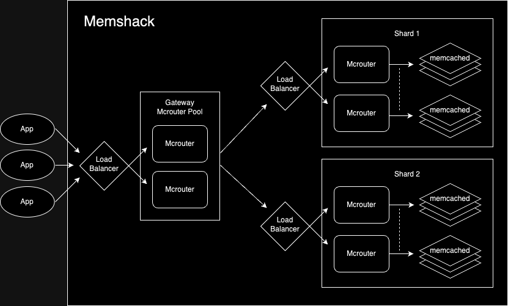

# Memshack

**Memshack** allows for deployment and management of a [Mcrouter](https://github.com/facebook/mcrouter) ([Memcached](https://github.com/memcached/memcached)) cluster using [Kubernetes](https://github.com/kubernetes/kubernetes) custom resource definitions.

Note that this project is _NOT_ production tested. I just wanted to write an operator in Rust.

## Usage

### Local testing with [kind](https://kind.sigs.k8s.io/)

#### 1. Build the docker image for the operator:

```
docker build -t memshack-operator .
```

This will build a [distroless](https://github.com/GoogleContainerTools/distroless) image containing the operator that we will run on our cluster.

#### 2. Load the image into your cluster:

```
kind load docker-image memshack-operator
```

This is necessary in order to run the operator pod(s).

#### 3. Add the operator deployment, roles and CRD to your cluster:

```
kubectl apply -f yaml/operator.yaml
```

After doing this, you should have a `memshack-operator` deployment, statefulset, and 2 operator pods running on the cluster. If not, something is wrong so check the pod logs.

#### 4. Create a `Memshack` resource:

A sample memshack is provided in the yaml directory so you can just do:

```
kubectl apply -f yaml/test.yaml
```

The test memshack runs a pool of 2 gateway mcrouter instances with 2 shards @ 2 replicas per shard:



Requests to the gateway are sent to the corresponding shard based on key hash, and from there the behavior across replicas is as follows:

- GET: uses the [LatestRoute](https://github.com/facebook/mcrouter/wiki/List-of-Route-Handles#latestroute) handle
- ADD/SET/DELETE: uses the [AllSyncRoute](https://github.com/facebook/mcrouter/wiki/List-of-Route-Handles#allsyncroute) handle

If you'd like to change the parameters, just update the `Memshack` resource as follows:

```yaml
apiVersion: example.memshack.com/v1
kind: Memshack
metadata:
  namespace: default
  name: test
spec:
  mcrouter_pool_size: 2 # number of mcrouter gateway instances
  num_replicas: 2 # number of replicas per shard
  num_shards: 2 # number of shards
  memcached_image: memcached:1.6-alpine # docker image to use for memcached
  mcrouter_image: mcrouter/mcrouter:latest # docker image to use for mcrouter
  mcrouter_port: 5000 # port to use for all mcrouter instances
```

#### 5. Expose the memshack service for testing:

```
kubectl port-forward service/test-memshack 5000:5000
```

#### 6. Run the controller test:

```
cargo test cache
```

This will create/read/update/delete some entries across all the memcached pods, and should pass if everything is working correctly.

## Contributing

Currently memshack exposes only a limited subset of the Mcrouter API. If you'd like to incorporate additional functionality, a good place to start is the mcrouter container commands of `resources::children::gateway::Deployment` and `resources::children::shard::Deployment`, which create the mcrouter `config-str` from parameters on the memcshack resource. Don't forget to open a PR 👍
